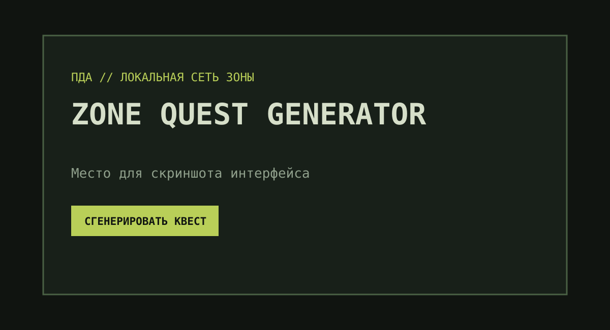

# Zone Quest Generator

> Небольшой генератор правдоподобных побочных квестов для атмосферы **S.T.A.L.K.E.R. Anomaly 1.5.3**.

Zone Quest Generator создаёт не набор случайно склеенных слов, а короткие законченные истории: у задания есть заказчик, подходящее место, завязка, цель, возможная развязка и награда.



> После публикации интерфейса замените `docs/screenshot-placeholder.svg` на актуальный скриншот приложения.

## Возможности

- 20 сюжетных шаблонов в восьми категориях: поиск человека, расследование, поиск предмета, спасение, доставка, возвращение потерянного, помощь группировке и странные события Зоны;
- база из 15+ заказчиков, 16 локаций и 15 вариантов наград;
- смысловые связи между шаблоном, заказчиком, локацией и наградой;
- отсутствие повторов шаблонов, пока не исчерпан полный цикл;
- адаптивный интерфейс в стиле терминала ПДА;
- копирование готового задания в буфер обмена;
- автоматические тесты и GitHub Actions.

## Быстрый запуск

Нужен [Node.js](https://nodejs.org/) 20 или новее.

```bash
git clone https://github.com/YOUR_USERNAME/zone-quest-generator.git
cd zone-quest-generator
npm start
```

Команда покажет локальный адрес (обычно `http://localhost:3000`). Откройте его в браузере. Также можно просто открыть `index.html`, но для полноценной работы модулей лучше использовать локальный сервер.

## Как пользоваться

1. Откройте страницу приложения.
2. Нажмите «Сгенерировать квест».
3. Прочитайте карточку задания или нажмите «Копировать квест», чтобы вставить текст в заметки, чат или документ.

## Структура проекта

```text
src/
├── data/                 # Базы персонажей, локаций, наград и сюжетных шаблонов
├── generator/            # Логика согласованного выбора данных
├── ui/                   # Отрисовка карточки и форматирование текста
└── main.js               # Связь генератора с интерфейсом
test/                     # Тесты Node.js
.github/workflows/        # Автоматический запуск тестов
```

## Как устроена генерация

В центре генератора — сюжетный шаблон. Он уже содержит логически связные завязку, цель и развязку, а также задаёт подходящие роли заказчика, признаки локации и класс награды. Затем генератор выбирает варианты только из совместимых списков. Поэтому не возникает сочетаний вроде лабораторного задания в неподходящем месте или награды, неуместной для истории.

## Тесты

```bash
npm test
```

Проверяется наличие обязательных полей, корректность типов и наград, целостность связанного шаблона, отсутствие ранних повторов и устойчивость при массовой генерации.

## Идеи для развития

- фильтрация по категории и локации;
- избранные задания и экспорт в Markdown;
- дополнительные сюжетные ветки и персонажи;
- переключатель оформления ПДА.

## Лицензия

Проект распространяется по [лицензии MIT](LICENSE). Это неофициальный фанатский проект и он не связан с правообладателями серии S.T.A.L.K.E.R.
